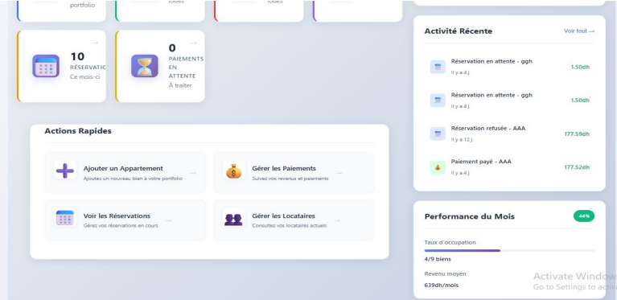
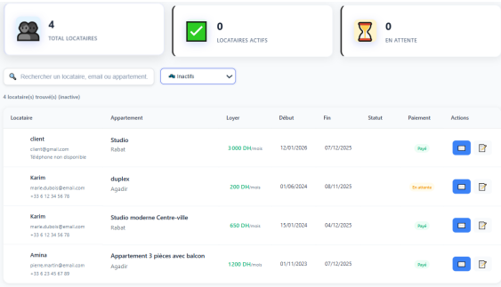
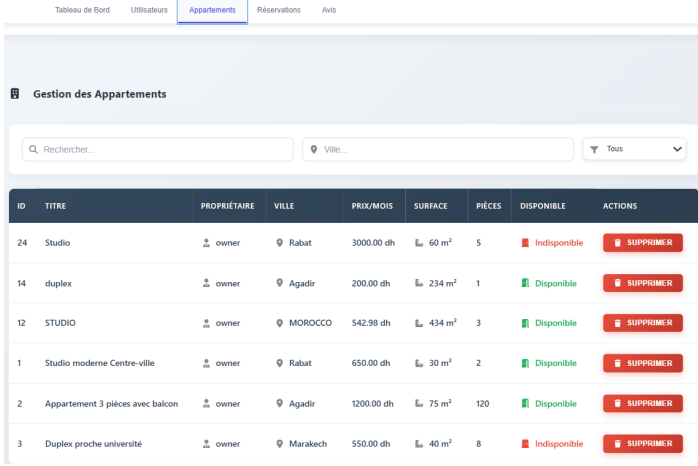
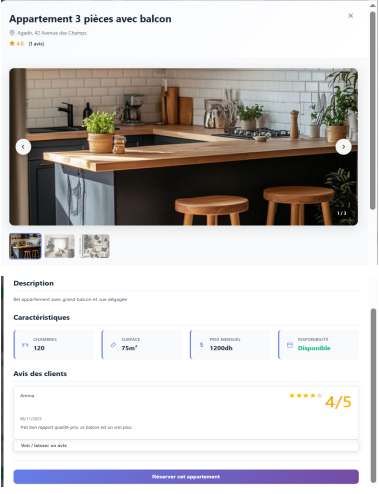
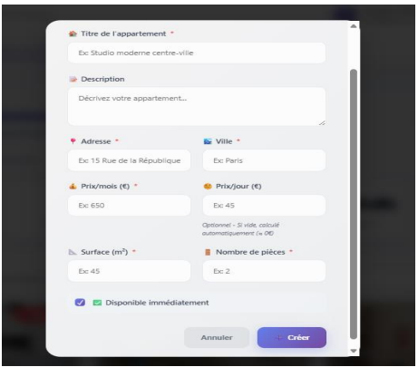
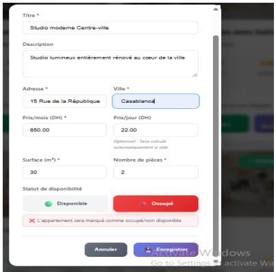
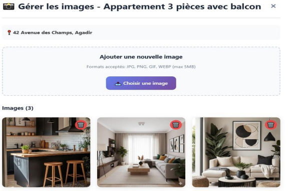
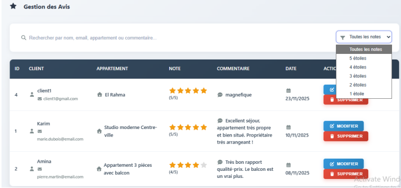
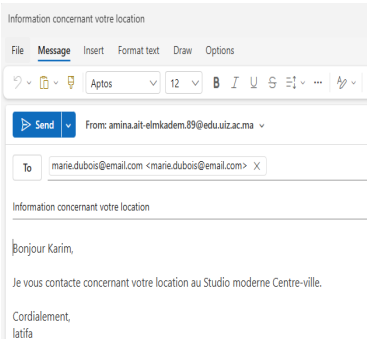

# Appartika - Plateforme de Gestion Locative Immobilière

**Appartika** est une solution Full-Stack moderne (React & Laravel) conçue pour digitaliser la gestion immobilière. Ce projet démontre ma maîtrise de l'architecture MVC, de la sécurité des API et du design d'interface dynamique.

---

## Aperçu de l'Interface

###  Tableau de Bord & Statistiques
*Vue d'ensemble de l'activité pour les propriétaires.*

###  Gestion des Appartements
*Le cycle complet du CRUD (Ajout, Modification, Détails).*
<table>
  <tr>
    <td></td>
    <td></td>
  </tr>
  <tr>
    <td></td>
    <td></td>
  </tr>
</table>

### ⚙️ Fonctionnalités Avancées
*Gestion des médias, système d'avis et automatisation.*

---

## 🛠️ Stack Technique & Compétences
Maîtrise complète des technologies suivantes pour ce projet :

* **Frontend :** React.js (Hooks, Axios, Bootstrap 5).
* **Backend :** Laravel (PHP), Architecture MVC, Programmation Orientée Objet (POO).
* **Sécurité :** Authentification via Laravel Sanctum (Tokens).
* **Base de données :** MySQL (Modélisation des relations complexes).
* **Conception :** UML (Diagrammes de classes et cas d'utilisation).

## 🚀 Installation rapide
1. **Backend :** `cd backend && composer install && php artisan migrate && php artisan serve`
2. **Frontend :** `cd frontend && npm install && npm start`

---
📧 **Contact :** Fatima Berkouch (Lead Developer) - [fatimaberkouch5@gmail.com]